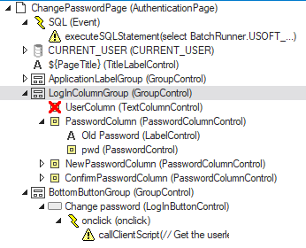

# Change password
||
|-|
|This template concerns the changing of a password for a user.|
|This consists of a couple of checks that ensures the old password is correct and a strong new password is to be set.|
|The password is encrypted and stored in the user table.|
## Overview
||
|-|
|This template consists of the following part(s):|
> ### Definer
||||
|-|-|-|
|TABLE|||
||`USOFT_T_USER`|Holds the username and the hashed password of the users.|
|BATCH|||
||`USOFT_CHANGE_PASSWORD_JOB`|series of semantical and syntactical checks before updating the users table.|
> ### Webdesigner
||||
|-|-|-|
||||
||`ChangePassword control (ExecuteSQLStatement)`|Simple control that calls the Change password batch.|
||`callChangePassword control (callClientScript)`|Call the ExecuteSQLStatement with the proper parameters.|
||`CURRENT_USER (Datasource)`|The user table filtered to the active user.|
## Installation
||
|-|
|Install the template by downloading the wizard and changing the names.|
|All the steps will be explained here.|
|This is also where you can change the names of the fields.|
|After the wizard is done new files will be generated ending with _replaced.xml.|
||
|-|
|1. Import the ChangePasswordDefiner_replaced.xml file in the definer under Teamwork > Import from file...|
|2. Import the ChangePasswordDatasource_replaced.xml file in the webdesigner under Tools > import|
|3. Import the ChangePasswordControls_replaced.xml file in the webdesigner under Tools > import|
|4. For an example implementation imprt the ChangePasswordPage.xml page in the webdesigner under Tools > import|

> The newly imported template will be ready for use in the definer and the webdesigner.
## How to use (creating a simple password reset page)
|||
|-|-|
|1. Install the template||
|2. In the webdesigner, create a new page|This is where the user can enter their new password|
|3. Create three inputs:|The old password with the id `old-password`|
||The new password with the id `new-password`|
||A confirmation of the new password with id `confirm-password`|
|4. Add a dummy event to the page.|This is where all the SQLstatements can be added to (For more info: [community site](https://community.usoft.com/sql-and-web-designer-116/sql-statements-671))|
|5. Add the ChangePassword SQLstatement to the page.|The control will be under the executeSQLstatement dropdown|
|6. Add a button. Add the callChangePassword script to the onclick event.|This control can be found under callClientScript|
|7. Add the datasource `CURRENT_USER`.|This can be found under datasources in the controls panel|
|8. Publish the page. The page structure should look like this:||

> > 
## Change log
> #### Created by [Danny Dorstijn](mailto:danny.dorstijn@usoft.com)
|Version|Author|Date|Description|
|:---|:---|:---|:---|
|v1.0|[Danny Dorstijn](mailto:danny.dorstijn@usoft.com) |`2022-10-28`|`Initial commit`|